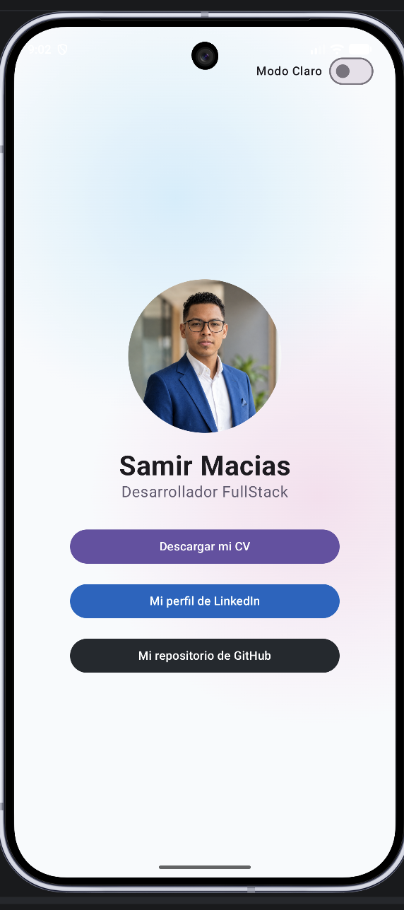
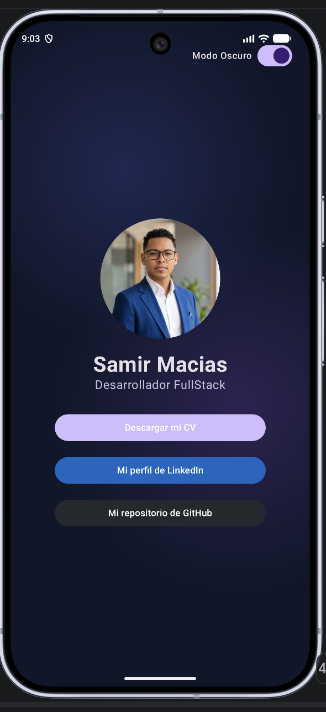

# 📱 Tarjeta de Presentación Interactiva - Android App


Aplicación Android nativa desarrollada en **Kotlin** y **Jetpack Compose** que funciona como una **Tarjeta de Presentación Digital e Interactiva** para **Samir Macias** (Desarrollador FullStack).

---

## 🖼️ Capturas de Pantalla

| Modo Claro ☀️ | Modo Oscuro 🌙 |
| :---: | :---: |
|  |  |

---

## ✨ Características Principales

* **🌓 Tema Dinámico (Modo Claro / Modo Oscuro):** Interruptor en la parte superior derecha para cambiar de tema en tiempo real mediante `MaterialTheme` y `darkColorScheme` / `lightColorScheme`.
* **🎨 Fondo Animado Ambiental (`AnimatedBackground`):** Animación fluida de orbes de luz en gradiente radial sobre `Canvas` que reacciona según el tema seleccionado. Diseñada para ser llamativa con un consumo mínimo de recursos de CPU y GPU.
* **📲 Generación de Códigos QR Locales (ZXing):**
  * Al pulsar los botones de **LinkedIn** o **GitHub**, la aplicación genera y muestra instantáneamente un código QR en un diálogo emergente.
  * Generación **100% offline y local** utilizando la biblioteca **ZXing**, garantizando rendimiento sin necesidad de conexión a Internet.
* **📄 Visualizador de CV Local:** Opción para descargar o visualizar el Currículum Vitae en PDF (`cvsamirdev.pdf`), extraído desde los recursos locales (`res/raw`) y abierto de forma segura mediante `FileProvider`.
* **🖱️ Botones Animados (`AnimatedButton`):** Animación suave de escala táctil al presionar los botones impulsada por `MutableInteractionSource` y `animateFloatAsState`.

---

## 🛠️ Tecnologías y Librerías Utilizadas

* **Lenguaje:** [Kotlin](https://kotlinlang.org/)
* **UI Framework:** [Jetpack Compose](https://developer.android.com/jetpack/compose) con **Material Design 3**
* **Generación de QR:** [ZXing Core](https://github.com/zxing/zxing) (`com.google.zxing:core:3.5.3`)
* **Carga de Imágenes:** [Coil](https://coil-kt.github.io/coil/) (`io.coil-kt:coil-compose:2.6.0`)
* **Gestión de Archivos:** `FileProvider` y `ContentUri` para abrir PDFs de manera segura
* **Versión mínima SDK:** Android 7.0 (API level 24)
* **Target SDK:** API level 37

---

## 📁 Estructura del Proyecto

```text
reto1_TarjetaPresentacion/
├── app/
│   ├── src/
│   │   └── main/
│   │       ├── java/com/example/myappli/
│   │       │   └── MainActivity.kt        # Lógica principal, UI en Compose y diálogo QR
│   │       ├── res/
│   │       │   ├── drawable/
│   │       │   │   ├── foto_perfil.png    # Fotografía de perfil
│   │       │   │   ├── captura_modo_claro.png
│   │       │   │   └── captura_modo_oscuro.png
│   │       │   └── raw/
│   │       │       └── cvsamirdev.pdf      # Currículum en formato PDF
│   │       └── AndroidManifest.xml        # Declaración de permisos y FileProvider
│   └── build.gradle.kts                   # Configuración del módulo y dependencias
├── build.gradle.kts
└── settings.gradle.kts
```

---

## 🚀 Requisitos e Instalación

### Prerrequisitos
* **Android Studio** (Ladybug / Jellyfish o superior).
* **JDK 11** o superior.
* Un dispositivo físico o emulador Android (API 24 o superior).

### Pasos para ejecutar
1. Clona este repositorio o descarga el proyecto:
   ```bash
   git clone https://github.com/Samir-Macias/reto1_TarjetaPresentacion.git
   ```
2. Abre el proyecto en **Android Studio**.
3. Sincroniza los archivos Gradle (`Sync Project with Gradle Files`).
4. Selecciona un dispositivo/emulador y presiona **Run** (`Shift + F10`).

---

## 👤 Autor

* **Samir Macias** - *Desarrollador FullStack*
* **GitHub:** [@Samir-Macias](https://github.com/Samir-Macias)
* **LinkedIn:** [Samir Macias](https://www.linkedin.com/in/samirmacias)
